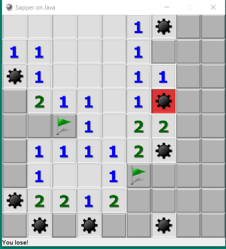

# Minesweeper

This project is a logic puzzle game.

### <u>Run guide:</u>

To build the project: *.\mvnw clean package*

To execute the app: *java -jar ./target/minesweeper.jar*

### <u>Technology stack:</u>

* Java: JDK 17
* Build: Maven

Application view

